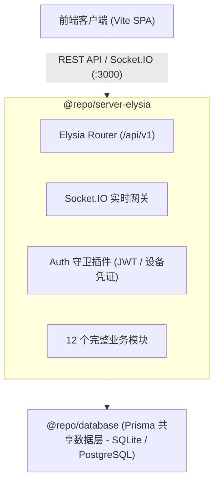

# @repo/server-elysia

基于 [Elysia.js](https://elysiajs.com/) 构建的现代化、高性能纯独立后端服务（Standalone Server），完整替代传统的 NestJS 单体服务（`@repo/server`）。

## 架构说明：完全独立运行 (Fully Standalone Architecture)

本项目为**纯独立运行架构**，无须依赖任何 NestJS 代理或转发，业务模块已 100% 原生实现：



1. **完全独立运行**：所有 12 个领域模块（包括鉴权、班级、教师、学生、座位、积分、榜单、课表、抽选、大屏绑定、实时通知与健康探针）全部在 Elysia 中原生实现，零外部后端依赖。
2. **严格对齐契约**：接口路径、响应包装格式（`{ data: ... }`、分页元数据）、错误码（`{ code, message, requestId }`）与权限逻辑 100% 与原 NestJS 契约兼容，前端无感知平滑对接。
3. **原生实时通信**：挂载原生 Socket.IO 网关，完美支持教室房间隔离（`class:${classId}`）、实时积分变动推送、座位更新广播与断线重连。

---

## 运行时支持

同时支持 **Bun** 原生极致性能与 **Node.js 24+** 跨平台兼容运行：

- **Bun 模式**（推荐，毫秒级启动与热更）：`bun --watch src/index.ts`
- **Node.js 模式**（标准跨平台兼容与 CI 自动化）：基于 `@elysiajs/node` 与 `tsx watch`

---

## 常用开发命令

在仓库根目录下运行：

```bash
# 使用 Bun 启动 Elysia 服务 (默认端口 3000，毫秒级热更)
bun run dev:elysia

# 使用 Node.js (tsx) 启动 Elysia 服务
bun run dev:elysia:node

# 单独对 Elysia 进行类型检查
bun --filter @repo/server-elysia typecheck

# 单独对 Elysia 进行代码格式规范检查
bun --filter @repo/server-elysia lint

# 构建打包产物到 dist/
bun --filter @repo/server-elysia build
```

---

## 核心目录结构

```
apps/server-elysia/
├── src/
│   ├── config.ts               # 环境变量与配置管理
│   ├── index.ts                # 主应用入口，挂载 Swagger、CORS、Socket.IO 与所有业务路由
│   ├── plugins/
│   │   ├── prisma.ts           # 共享 @repo/database 的 Prisma 客户端与连接管理
│   │   ├── auth.ts             # JWT 解析、设备凭据守卫宏 (requireUser, requireDisplayDevice, requireAuth)
│   │   └── error-handler.ts    # 全局错误捕获，对齐响应契约 { code, message, requestId }
│   └── modules/
│       ├── auth/               # 登录、Token 刷新、登出、教师邀请码消费
│       ├── classrooms/         # 班级信息查询与配置修改
│       ├── displays/           # 大屏 6 位绑定码、双向配对、设备管理、Bootstrap 状态同步
│       ├── health/             # 系统健康探针与运行时状态 (GET /api/v1/health)
│       ├── random-pick/        # 课堂随机点名抽选
│       ├── ranking/            # 积分榜单（Top3 与周环比进步榜）
│       ├── realtime/           # Socket.IO 实时事件分发网关与房间管理
│       ├── schedules/          # 课程表与排课模板管理
│       ├── scores/             # 积分规则、积分流水、撤销、周期汇总、班委授权
│       ├── seating/            # 座位布局、版本快照、版本回退与草稿发布
│       ├── students/           # 学生花名册、状态管理与 Excel 批量导入
│       └── teachers/           # 任课教师管理、邀请码生成与撤销
├── .env.example
├── package.json
└── tsconfig.json
```

---

## 接口文档

服务启动后可直接访问 Swagger UI：
- 文档界面：`http://localhost:3000/api/docs`
- OpenAPI JSON 规范：`http://localhost:3000/api/docs/json`
